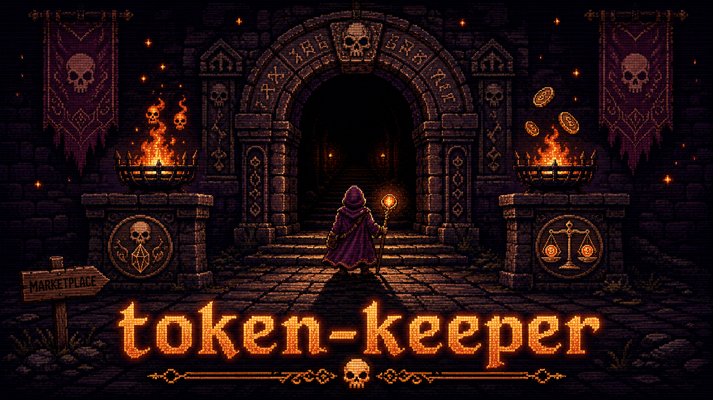

**한국어** · English (TODO)

<p align="center">
  
</p>

> **Claude Code 비용 던전에 입장할 동료들을 고르는 마켓플레이스.**

Claude Code 를 오래 쓰다 보면 캐시는 잠들고, 토큰은 몰래 새고, 비용 몬스터가 조용히 자랍니다.<br/>
token-keeper 는 캐시를 깨우고 사용량을 추적해 비용 던전을 함께 공략하는 플러그인 파티입니다.

[던전 입장](#빠른-시작) • [동료 선택](#팀원-소개) • [플러그인 목록](#사용-가능한-플러그인) • [요구사항](#요구사항) • [라이선스](#라이선스)

---

## 팀원 소개

던전 입구에서 합류할 동료들입니다. 필요한 동료를 골라 설치하세요.

<table>
  <tr>
    <td width="180" align="center" valign="top">
      <br/>
      <strong>cache-necromancer</strong>
    </td>
    <td valign="top">
      <br/>
      <p><strong>“잠든 캐시여... 일어나라.”</strong></p>
      <p>자리를 비웠을 때 캐시가 만료되지 않게 해줍니다.</p>
      <p><code>/plugin install cache-necromancer</code></p>
      <p>
        <a href="https://github.com/token-keeper/cache-necromancer">Repository</a>
      </p>
    </td>
  </tr>
  <tr>
    <td width="180" align="center" valign="top">
      <br/>
      <strong>token-tracker</strong>
    </td>
    <td valign="top">
      <br/>
      <p><strong>“이 프롬프트, 얼마짜리인지 알려드리리다.”</strong></p>
      <p>매 응답 끝에 토큰 사용량, 캐시 적중률, 누적 비용을 요약합니다.</p>
      <p><code>/plugin install token-tracker</code></p>
      <p>
        <a href="https://github.com/token-keeper/token-tracker">Repository</a>
      </p>
    </td>
  </tr>
</table>

---

## 빠른 시작

### 1. 마켓플레이스 등록 (처음 한 번만)

```
/plugin marketplace add token-keeper/plugins
```

### 2. 플러그인 설치

```
/plugin install cache-necromancer
/plugin install token-tracker
```

또는 메뉴에서 고르기:

```
/plugin install
```

### 3. Claude Code 재시작

설치/업데이트 후 플러그인 활성화를 위해 재시작합니다.

### 4. 업데이트

```
/plugin update
```

---

## 사용 가능한 플러그인

| 플러그인 | 한 줄 설명 |
|---------|------|
| [cache-necromancer](https://github.com/token-keeper/cache-necromancer) | 1시간 프롬프트 캐시 만료 직전 자동 갱신 — `cache_read` 유지로 다음 입력 비용 ×20 폭발 방지 |
| [token-tracker](https://github.com/token-keeper/token-tracker) | 매 응답 끝에 1줄 토큰 비용 요약 — 캐시 적중률 / 출력 토큰 / 누적 비용 |

> 플러그인은 계속 추가됩니다.

---

## 왜 이 플러그인들인가

- **비용에 집중** — 기능 추가가 아니라 **이미 새고 있는 비용 막기**가 목표. cache-necromancer 는 만료 직전 wake, token-tracker 는 매 turn 실측치 노출
- **silent** — 모든 plugin 은 chat 흐름을 막지 않음. hook 실패해도 사용자 입력은 그대로 처리
- **단일 책임** — 각 plugin = 단 하나의 일. cache-necromancer = TTL 갱신만, token-tracker = 비용 표시만
- **민감정보 미기록** — log 는 sid 해시 + 토큰 수만. prompt 본문 / 응답 내용 X
- **한글 우선** — 한글 문서, slash command 한국어 설명. 영문 README 는 추후 추가

---

## 요구사항

- **[Claude Code](https://docs.anthropic.com/en/docs/claude-code)** 전용
- **macOS / Linux**: 바로 사용 가능
- **Windows**: WSL2 권장
- Python 3.11+ (각 plugin 내부 `.venv` 자동 구성)

---

## 기여

이슈 / 제안 → 각 plugin repo Issues:

- https://github.com/token-keeper/cache-necromancer/issues
- https://github.com/token-keeper/token-tracker/issues

---

## 라이선스

MIT
