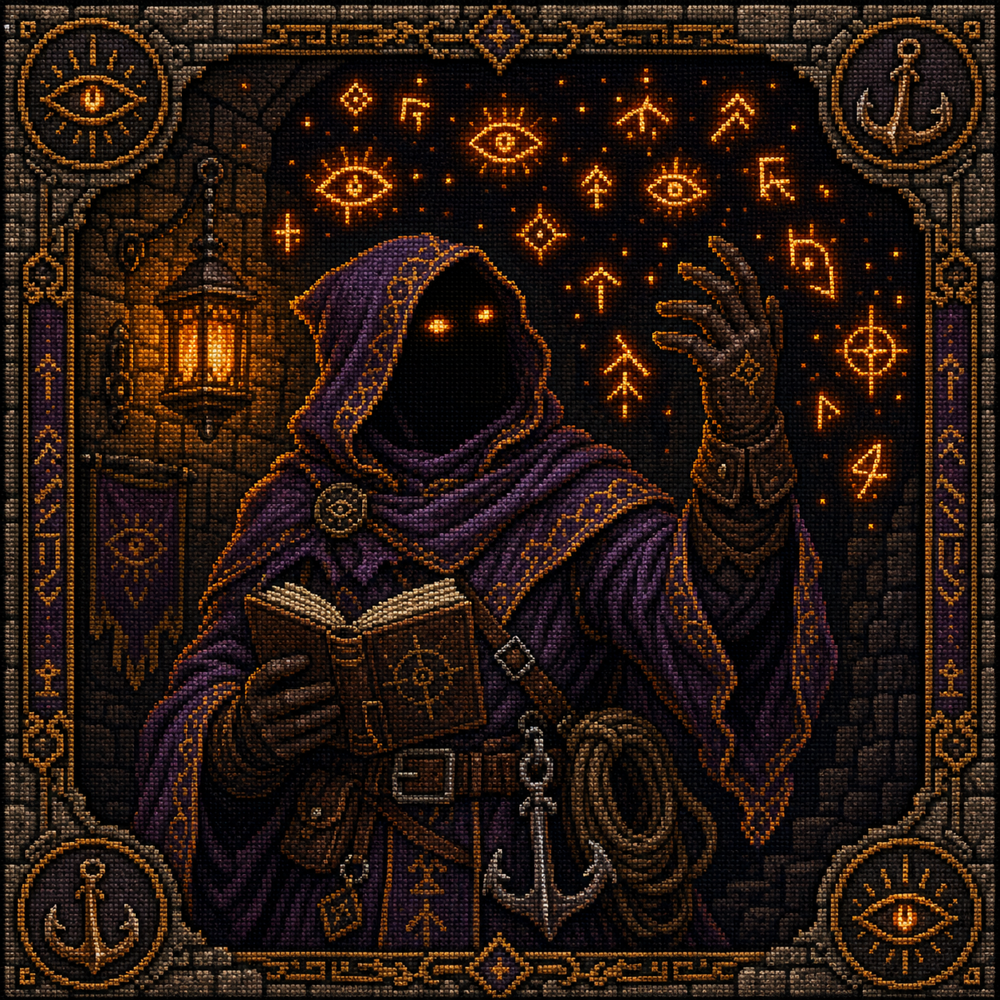

**한국어** · English (TODO)

<p align="center">
  
</p>

> **Claude Code 토큰 비용·세션 관리 플러그인 마켓플레이스.**

캐시 갱신 · 비용 추적 · hook 관찰 · 요청 이력 조회 — 세션 운영 플러그인 모음입니다.

[빠른 시작](#빠른-시작) • [팀원 소개](#팀원-소개) • [플러그인 목록](#사용-가능한-플러그인) • [요구사항](#요구사항) • [라이선스](#라이선스)

---

## 팀원 소개

필요한 플러그인을 골라 설치하세요.

<table>
  <tr>
    <td width="180" align="center" valign="top">
      <br/>
      <strong>cache-necromancer</strong>
    </td>
    <td valign="top">
      <br/>
      <p><strong>“잠든 캐시여... 일어나라.”</strong></p>
      <p>자리를 비웠을 때 캐시가 만료되지 않게 해줍니다.</p>
      <p><code>/plugin install cache-necromancer</code></p>
      <p>
        <a href="https://github.com/token-keeper/cache-necromancer">Repository</a>
      </p>
    </td>
  </tr>
  <tr>
    <td width="180" align="center" valign="top">
      <br/>
      <strong>token-tracker</strong>
    </td>
    <td valign="top">
      <br/>
      <p><strong>“이 프롬프트, 얼마짜리인지 알려드리리다.”</strong></p>
      <p>매 응답 끝에 토큰 사용량, 캐시 적중률, 누적 비용을 요약합니다.</p>
      <p><code>/plugin install token-tracker</code></p>
      <p>
        <a href="https://github.com/token-keeper/token-tracker">Repository</a>
      </p>
    </td>
  </tr>
  <tr>
    <td width="180" align="center" valign="top">
      <br/>
      <strong>hook-raider</strong>
    </td>
    <td valign="top">
      <br/>
      <p><strong>“던전 안 모든 훅의 움직임, 이미 보고 있소.”</strong></p>
      <p>Claude Code 의 모든 hook 이벤트(30종)를 캡처해 로컬 웹 UI 에서 대화 turn 단위로 실시간 관찰합니다.</p>
      <p><code>/plugin install hook-raider</code></p>
      <p>
        <a href="https://github.com/token-keeper/hook-raider">Repository</a>
      </p>
    </td>
  </tr>
  <tr>
    <td width="180" align="center" valign="top">
      <br/>
      <strong>what-did-i-say</strong>
    </td>
    <td valign="top">
      <br/>
      <p><strong>“방금 내리신 명, 여기 적어두었습니다.”</strong></p>
      <p>턴이 끝날 때 방금 요청한 프롬프트와 시각을 한 줄로 다시 보여주고, <code>/wdis N</code> 으로 최근 요청 이력을 조회합니다.</p>
      <p><code>/plugin install what-did-i-say</code></p>
      <p>
        <a href="https://github.com/token-keeper/what-did-i-say">Repository</a>
      </p>
    </td>
  </tr>
</table>

---

## 빠른 시작

### 1. 마켓플레이스 등록 (처음 한 번만)

```
/plugin marketplace add token-keeper/plugins
```

### 2. 플러그인 설치

```
/plugin install cache-necromancer
/plugin install token-tracker
/plugin install hook-raider
/plugin install what-did-i-say
```

또는 메뉴에서 고르기:

```
/plugin install
```

### 3. Claude Code 재시작

설치/업데이트 후 플러그인 활성화를 위해 재시작합니다.

### 4. 업데이트

```
/plugin update
```

---

## 사용 가능한 플러그인

| 플러그인 | 한 줄 설명 |
|---------|------|
| [cache-necromancer](https://github.com/token-keeper/cache-necromancer) | 1시간 프롬프트 캐시 만료 직전 자동 갱신 — `cache_read` 유지로 다음 입력 비용 ×20 폭발 방지 |
| [token-tracker](https://github.com/token-keeper/token-tracker) | 매 응답 끝에 1줄 토큰 비용 요약 — 캐시 적중률 / 출력 토큰 / 누적 비용 |
| [hook-raider](https://github.com/token-keeper/hook-raider) | Claude Code 의 모든 hook 이벤트(30종)를 캡처해 로컬 웹 UI 에서 대화 turn 단위로 실시간 관찰 — hook 학습·디버깅 도구 |
| [what-did-i-say](https://github.com/token-keeper/what-did-i-say) | 턴이 끝날 때 방금 요청한 프롬프트+시각을 한 줄로 재표시, `/wdis N` 으로 최근 요청 이력 조회 |

> 플러그인은 계속 추가됩니다.

---

## 왜 이 플러그인들인가

- **비용과 세션 가시화에 집중** — 새는 비용을 막고(cache-necromancer · token-tracker), 세션에서 벌어지는 일을 드러낸다(hook-raider · what-did-i-say)
- **silent** — 모든 plugin 은 chat 흐름을 막지 않음. hook 실패해도 사용자 입력은 그대로 처리
- **단일 책임** — 각 plugin = 단 하나의 일. cache-necromancer = TTL 갱신만, token-tracker = 비용 표시만, hook-raider = 이벤트 관찰만, what-did-i-say = 요청 재표시만
- **로컬 처리** — 데이터는 머신 밖으로 나가지 않음. 로그는 최소한(sid 해시 · 토큰 수)만 기록
- **한글 우선** — 한글 문서, slash command 한국어 설명. 영문 README 는 추후 추가

---

## 요구사항

- **[Claude Code](https://docs.anthropic.com/en/docs/claude-code)** 전용
- **macOS / Linux**: 바로 사용 가능
- **Windows**: WSL2 권장
- cache-necromancer · token-tracker: Python 3.11+ (각 plugin 내부 `.venv` 자동 구성)
- hook-raider · what-did-i-say: Node.js 18+ (외부 의존성 없음)

---

## 기여

이슈 / 제안 → 각 plugin repo Issues:

- https://github.com/token-keeper/cache-necromancer/issues
- https://github.com/token-keeper/token-tracker/issues
- https://github.com/token-keeper/hook-raider/issues
- https://github.com/token-keeper/what-did-i-say/issues

---

## 라이선스

MIT
